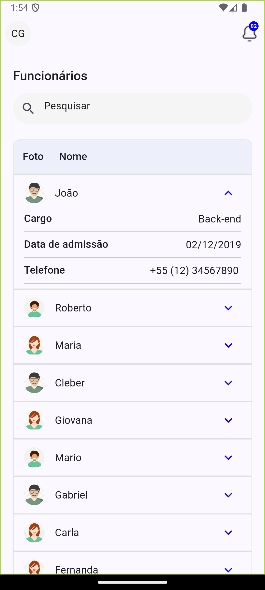

# employees_list

App de listagem de funcionários

  
  

## Sobre o projeto

Esse projeto lista funcionários a partir de requisição feita a API.

`Arquitetura`
- Feature First para estruturação de diretórios
- Para arquitetura  MVVM + Repository pattern
- Para gerenciamento de estado usamos BloC/Cubit
- Para serviço de injeção de dependência usamos GetIt
- Criação de package customizado de Design System, para cores, dimensões e tipografias.
- Aplicação de princípios SOLID

## Pré requisitos
Para rodar a aplicação é necessário ter:
- Versão Flutter 3 ou superior
- Versão Dart correspondente
- Java 17
- Ruby + Cocoapos(pra execução IOS)

Para mais informações consulte a [Documetação oficial](https://docs.flutter.dev/) do Flutter.
